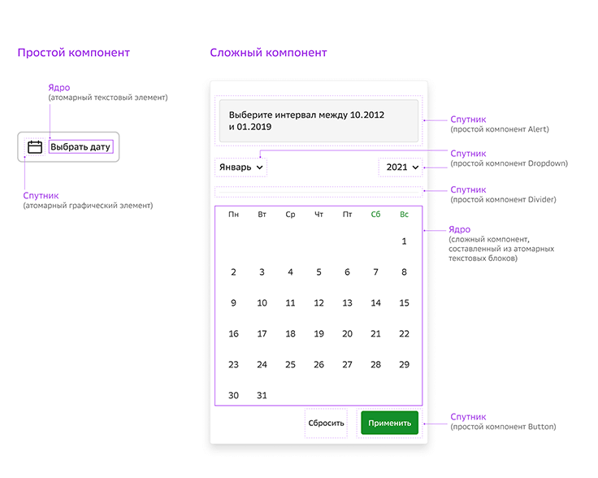
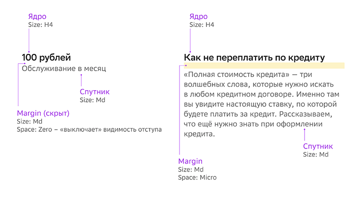
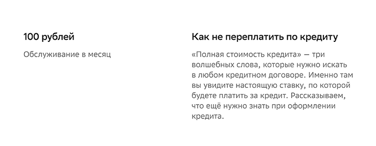

# 1. Анатомия компонента

## Что такое компонент

Компоненты дизайн-системы – это объекты многоразового использования. С помощью этих строительных блоков собираются экраны и продуктовые сценарии. Простые компоненты состоят из атомарных неделимых элементов (иконок, текстовых блоков с заданным стилем и динамических отступов). Из простых компонентов (таких, как кнопки, поля ввода, чекбоксы) собираются сложные (карточки, баннеры, календари). Из которых в свою очередь, собираются шаблоны и сценарии.

Для того, чтобы описать анатомию компонента, иерархию и отношение между его частями, мы введена метаформа гравитации и две абстракции: ядро и спутник.

* **Ядро** - смысловая часть компонента, определяющая его функцию.

* **Спутник** - вспомогательная (несамостоятельная) часть компонента.

И ядром, и спутником могут служить как атомарные элементы, так и простые компоненты в составе сложных.

## Принципы гравитации

1. В каждой группе есть главный объект (ядро) и дополнительный (спутник)
2. Между объектами есть расстояние и это не просто число, которое надо запомнить, а невидимые «дощечки»
3. Размер этих дощечек-отступов не фиксированный, а динамический  и настраивается под конкретную задачу с помощью параметра Space
4. Каждому текстовому стилю определен свой диапазон размеров  динамических отступов и присвоены такие же названия
5. И все позволяет получить максимально гибкий инструмент для создания иерархии в макете.

**Закон новой гравитации гласит:**

> Чем больше объект по массе и смыслу – тем больше отступ от других объектов.

Зачем управлять отступами и как действует закон гравитации, рассмотрим на конкретном примере.

Перед нами два одинаковых по размеру ядра (заголовка) и спутника (описания), но:

* в первом варианте – спутник имеет меньшую массу (1 строка) и смысл (не имеет смысла без заголовка), поэтому «притягивается» ближе к своему ядру
* во втором варианте – спутник имеет большую массу (7 строк) и смысл (вполне может быть самостоятельным элементом), поэтому «отдаляется» от заголовка за счет увеличения размера отступа.

Если бы отступы были фиксированными, это выглядело бы так:

