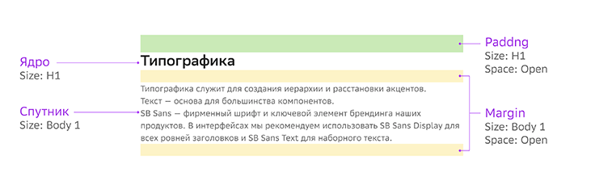

# 2. Динамические отступы

Между ядром и спутниками в компоненте существуют невидимые пробельные элементы – динамические отступы. С их помощью формируется размер и границы компонента, а также задается расстояние между его частями.

Отступы в дизайн-системе – это не пустое пространство между элементами, а физические объекты с набором параметров.

> *На примере А: объекты отбиваются друг от друга с помощью настройки числовых значений. Между объектами – пустое пространство, числовое значение необходимо запоминать и перепроверять. На примере Б: группа компонентов с динамическими отступами. Отступы имеют «физический» размер, компоненты стоят друг под другом как кубики. Это исключает возможность ошибки и лишнего пространства внутри макета.*

## Базовый модуль (BaseX)

Базовый модуль (BaseX) - это единица "массы" применяемая для выражения отношений между элементами. Позволяет выражать размеры динамических отсупов и высоты строки в базовых единицах и контролировать их взаимосвязь.

Размер базового модуля - **4px**

## Типы отступов

Существует два типа динамических отступов: внутренние (padding) и внешние (margin).

* **Padding**

    Паддинг – это внутренний отступ (выделен зеленым). Является составной частью компонента, увеличивает его размер (массу) и границы.

* **Margin**

    Маржин – это внешний отступ (выделены желтым). Влияет на расстояние между компонентами или частями компонента. У маржина есть отличительное свойство: если два маржина оказываются рядом, меньший из них скрывается.

## Направления отступов

Динамические отступы могу распологаться в двух направления:

* **Horizontal** - горизонтально (справа/слева)
* **Vertical** - вертикально (сверху/снизу)

## Параметры отступов

Динамическим отступ называется потому, что его величина формируется из двух параметров:

* **Size**

    Это базовый размер динамического отступа, который определен высотой строки (Line Hight) соответствующего по названию текстового стиля.
    Текстовые стили: `H1, H2, H3, H4, H5, Body 1, Body 2, Caption, Lg, Md, Sm`.

* **Space**

    Это переменный параметр, который определяется дизайнером в соответствии с функцией и иерархией объекта. Существует пять видов этого параметра: `Open, Inner, Micro, Nano, Zero`.

> Нагляднее – в [сводной таблице](#scale-table)

### Space

* **Open Space**

    Равен базовому размеру (Size). Применяется только к самостоятельным объектам на странице (заголовки секций и параграфы текста).

Для объектов внутри компонентов применяются следующие виды параметра:

* **Inner Space**

    Меньше, чем Size (базовый размер) на 1BaseX. Используется между большими объектами внутри компонента.

* **Micro Space**

    Меньше Size на 2BaseX. Используется между средними или однотипными объектами объединенными в группу.

* **Nano Space**

    Меньше Size на 3BaseX. Используется между самыми мелкими объектами (самыми низкими в иерархической структуре компонента).

* **Zero Space**

    Этот параметр отключает видимость отступа.

### Scale table

> Шкала размеров динамических отступов

В сводной таблице отображены связи параметров текстовых стилей и динамических отступов. Высота строки (Line height) текстового стиля и размер Dynamic Indent указаны в базовых модулях (BaseX).

**x** - Базовый модуль (BaseX)

