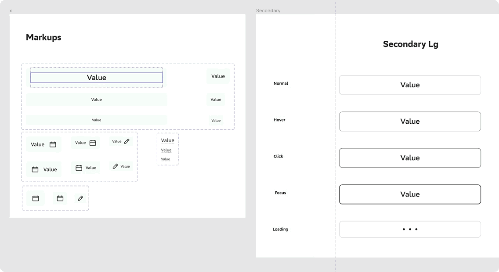
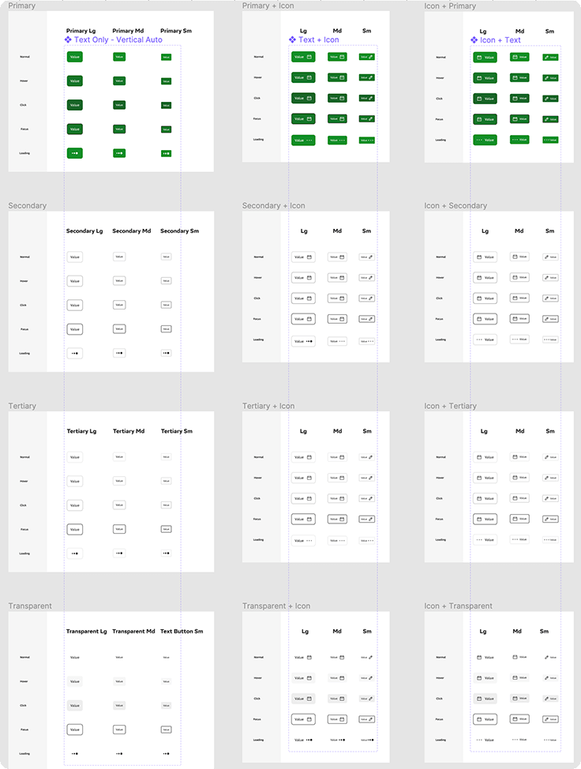

# 3. Принцип сборки компонента

Процесс создания компонента состоит из двух шагов: построения скелета (markup) и его тиражирования (создания instance).

## Markup

Маркап – это заготовка компонента. В нем задаются базовые свойства:

* форма
* текстовый стиль
* состав и отношения (расстояния) между элементами

Маркап служит для эффективного управления изменениями в копиях. Например, если вы измените текстовый стиль родительского маркапа, он изменится и во всех его инстансах.

**!** **Цвет не является свойством маркапа**

## Instance

Инстанс – это дочерняя копия markup. Инстансы создаются для отображения разных вариантов состояний компонента (primary/secondary, hover/click, размер desktop /mobile и т.п.).

*Варианты размеров и состояний кнопки с иконкой. Каждое состояние – это дочерняя копия маркапа.*

### Свойства инстансов

Инстансы наследуют базовые свойства родительского маркапа, но при этом имеют свои независимые свойства:

* цвет заливки, текста и обводки
* радиус скругления
* размер и цвет тени
* видимость составных элементов

#### В инстансе нельзя изменить

* размеры атомарных элементов
* позицию элементов
* форму элементов
* внутренние привязки
