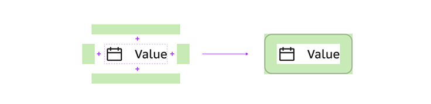
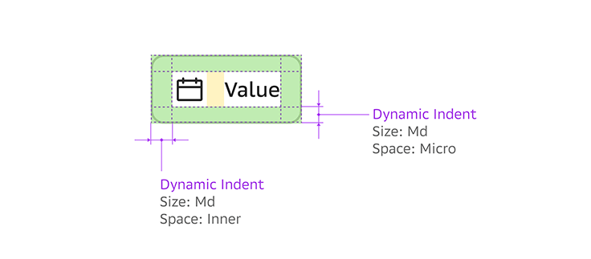

# 4. Правила группировки

В дизайн-системе есть три типа обёрток. Все они служат для разметки макета и группировки объектов, но каждый имеет свое уникальное свойство.

---

## Padding Wrapper

> Реализация одного из типов Dynamic Indent.

Паддинг враппер – это обёртка вокруг объекта или группы объектов, которая присваивает ему внутренние динамические отступы (Padding) со всех сторон. Паддинги являются частью компонента, вместе с размером ядра формирует размер и границы компонента.

### Свойства обертки Padding Wrapper

* Объединяет компоненты в одну группу и изолирует от другой внутри смыслового блока.
* При «столкновении» двух оберток Padding Wrapper каждая из групп сохраняет все свои отступы.
* Объект или группа объектов завёрнутая в паддинг враппер может иметь внутренний отступ с любой стороны или быть обрамленной ими со всех сторон.
* Парных отступы в группе имеют одинаковый размер. Например, если верхний горизонтальный паддинг имеет размер Md/Micro Space, то и нижний горизонтальный – должен быть Micro Space.
* Горизонтальные и вертикальные отступы в группе могут иметь разные значения параметра Space.

> *На этом примере видно, что размер горизонтальных отступов меньше, чем вертикальных. Это сделано для оптической компенсации.*

---

## Margin Wrapper

> Реализация одного из типов Dynamic Indent.

Маржин враппер – это обёртка вокруг объекта или группы объектов, которая присваивает ему внешние динамические отступы (Margin) со всех сторон. Маржины задают расстояние между объектами или его частями.

### Свойства обертки Margin Wrapper

* Используется для группировки однотипных (близкие по смыслу) или одинаковых по массе объектов (например, несколько чекбоксов или полей ввода).
* При «столкновении» двух Margin – меньший маржин скрывается.
* Объект или группа объектов завёрнутая в маржин враппер может иметь внешний отступ с любой стороны или быть обрамленной ими со всех сторон.
* Парных отступы в группе имеют одинаковый размер.
* Горизонтальные и вертикальные отступы в группе могут иметь разные значения параметра Space.

---

## Indents Wrapper

> Реализует функционал Dynamic Indent обоих типов.

Indents Wrapper – это обёртка вокруг группы объектов, которая может присваивать ей одновременно внутренние и внешние отступы со всех сторон.

Совмещает в себе Margin Wrapper и Padding Wrapper.

---

## List Wrapper

> Является расширением Indents Wrapper с дополнительными условиями.

List Wrapper – это обёртка вокруг группы объектов, которая может присваивать ей одновременно внутренние и внешние отступы со всех сторон, но при этом «отрезает» крайние внешние отступы (Margin) у первого и последнего объекта в группе.

### Свойства List Wrapper

* Имеет два направления: вертикальное и горизонтальное.
* При «попадании» группы объектов во враппер самый первый объект группы теряет свой верхний или левый внешний маржин, самый последний – нижний или правый.
* Группа объектов завёрнутая во враппер может иметь внутренний и/или внешний отступ с любой стороны или быть обрамленной ими со всех сторон.
* Парные отступы в группе имеют одинаковый размер.
* Горизонтальные и вертикальные отступы в группе могут иметь разные значения параметра Space.
* Между объектами можно установить автоматический отступ

---

## Section

Section – не является оберткой или контейнером, поэтому не имеет особых свойств, это инструмент для создания секции при разметки страницы. Он представляет собой блок с заголовком и динамическими отступами сверху и снизу. Внутрь блока вставляются обёртки, контенеры и компоненты. Можно отключать видимость любого отступа в структуре объекта.
