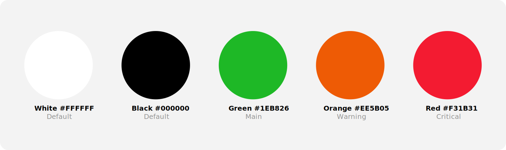
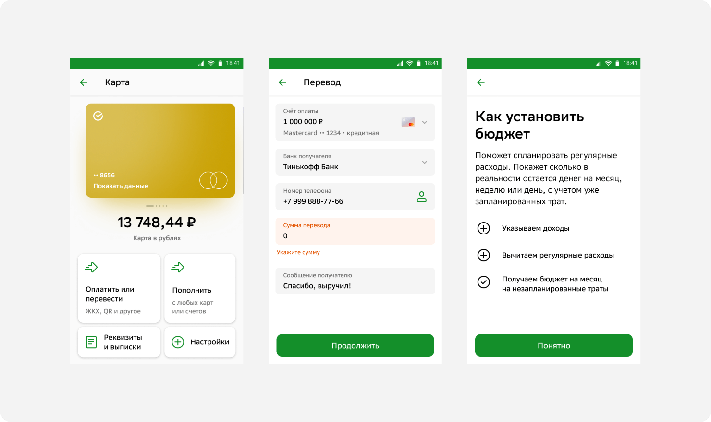
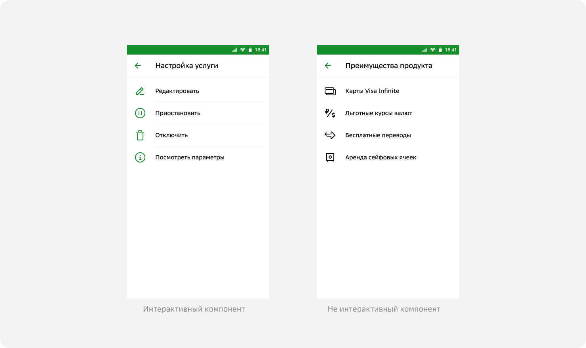
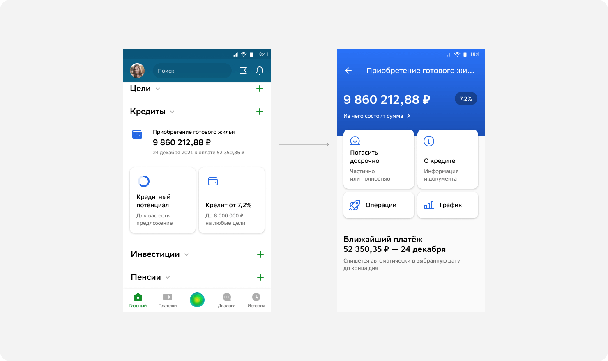
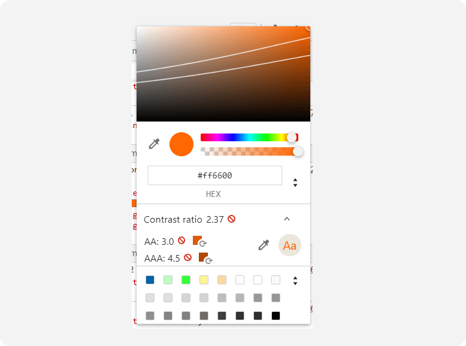

# 5. Цвет

Цвет — часть визуального языка бренда. Важно придерживаться принятых значений и общих правил цветового кодирования. Даже незначительные отклонения могут нарушить визуальную согласованность и ухудшить UI продукта.

## Палитры (Palette)

### Основная палитра (Main Palette)

Основная палитра дизайн-системы содержит общие цвета для всех сервисов проектов.

### Дополнительная палитра (Extended Palette)

Если у сервиса или проекта есть свой фирменный цвет, который не удаётся найти в основной палитре, то такие добавляются в дополнительную палитру Extended Palette. Использовать эти дополнительные рекомендуется только тем, кто их добавлял.

### Палитра оттенков черного (Graphite Palette)

Чёрный цвет с прозрачностью по альфа-каналу создаёт оттенки серого, которые достаточно часто можно встретить в приложении. Все принятые значения прозрачности представлены в палитре цветов Graphite.

Оттенки палитры Graphite и ахроматичные цвета с прозрачностью уместно использовать для фонов и второстепенного текстового контента. А также при смягчении резкого контраста, например в парах для светлой и тёмной тем.

## Основные цвета

Коммуникация с пользователем строится на базовых цветах: Green, Оrange, Red, Black и White.

>Основные цвета приложения

* Green — брендовый цвет (Main). Используйте его для интерактивных компонентов, позитивных событий и статусов.
* Оrange — предупреждающий цвет (Warning). Используйте его как настораживающий триггер.
* Red — цвет негативного сообщения (Critical). Используйте его как триггер критического сообщения.
* Black и White — нейтральные цвета. Подходят для графики и основного текстового контента.

### Контекст и акценты

Каждый цвет несёт в себе функцию. Цвет помогает расставить акценты, подсказывает пользователю особенности взаимодействия, указывает на интерактивность элементов.

> Верно расставленные акценты

Акценты всегда должны быть смещены в сторону интерактивных компонентов, таких как кнопки, ячейки, ссылки или любые другие, при взаимодействии с которыми происходит какое-то действие.

> Слева кликабельные ячейки, справа — нет

## Продуктовый цвет

Продуктовая команда может выбрать и закрепить акцентный цвет своего сервиса. Тогда брендовый Green можно заменить на этот цвет в некоторых случаях, например, на иконках в интерактивных ячейках и карточках. При этом триггеры Warning и Critical всегда остаются без изменения базового цвета.

> Уникальный цвет продукта

Ваш продуктовый цвет не должен пересекаться с цветом другого сервиса.

## Стандарты доступности

Дизайн приложения должен соответствовать стандарту WCAG AA, то есть соблюдать контрастность контента и фона. Всего существует три уровня доступности:

* WCAG AAA подразумевает максимальную контрастность — чёрный текст на белом фоне. Следовать этому стандарту в реальном интерфейсе практически невозможно.
* WCAG AA — умеренные требования. Стандарт заботится о людях со слабым зрением и учитывает отображение на плохих дисплеях (или на хороших при ярком солнце). Его поддерживает большинство крупных компаний. Например, Apple, в том числе на iOS.
* WCAG A имеет минимальный список требований. Все приложения, за редким исключением, соответствует этому стандарту по умолчанию.

Проверить контрастность сочетания цветов можно в панели разработчика хрома.

