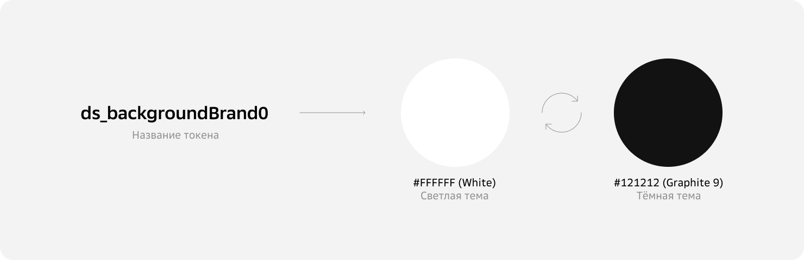
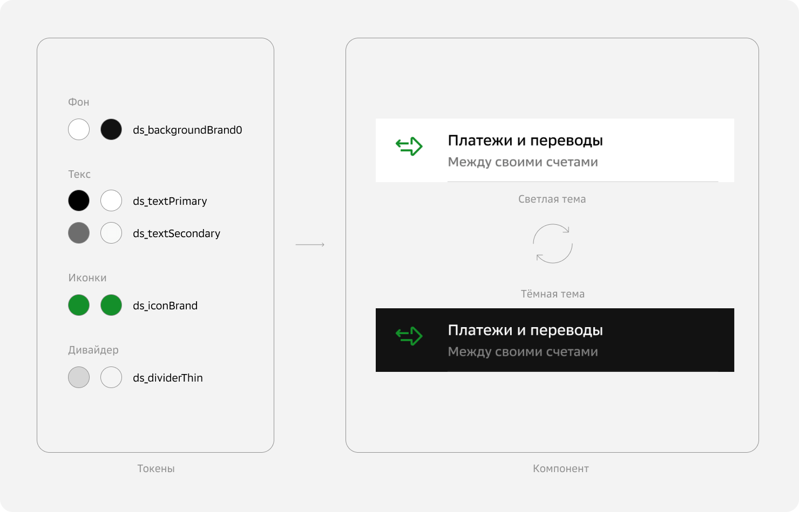
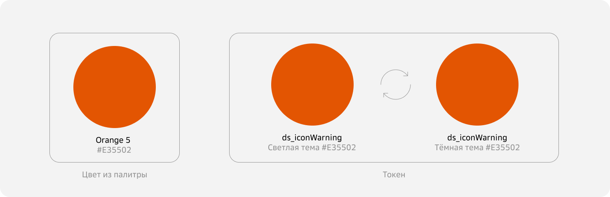

# 6. Токены

Токены  — это уникальные идентификаторы, которые обозначают соответствия переменных в разных темах приложения. Токены могут определять цвет, стиль текста, скругление углов, отступы и другие параметры.



Токены незаменимы в больших продуктах, потому что позволяют делать массовые обновления автоматически. Изменение значений токена отражается во всех компонентах, содержащих его. Такой подход оптимизирует процессы дизайна и разработки, поддерживать консистентность становится гораздо проще.



## Токены значений

Токены значений используются для числовых и других параметров, кроме цветов. Они не содержат информацию о теме и задаются в виде списка переменных.

### Название

Названия делаются по правилу, поддерживая консистентность. Токен всегда назван латиницей со строчной буквы.
Как пример рассмотрим структуру названия токена радиуса границы **radius_border_block_small**:

* **[ radius ]** — категория;
* **[ border ]** — свойство, может быть: text, background, и другое;
* **[ block ]** — элемент к которому применяется.
* **[ small ]** — свойство элемента (не обязательно).

## Токен цвета

Токен цвета и цвет из палитры не одно и то же. Токену всегда присвоено несколько цветовых значений: по одному для каждой темы. Как минимум токен содержит цветовую пару для светлой и тёмной темы. Цветовая пара токена может состоять из одинаковых оттенков, если не нужна смена цвета в разных темах.



Рекомендуем использовать именно токены цвета. Статически прописывать данные цвета в коде допустимо только в исключительных случаях. Фиксированные цвета сложно поддерживать в дизайне и коде: они не поддаются системному обновлению и править их приходится вручную. Когда в дизайне всем компонентам назначены токены, перевести макеты из светлой темы в тёмную можно в два клика.

### Новые токены

Иногда чтобы создать новую продуктовую концепцию или кастомный компонент, может понадобиться новый токен.

Основные правила:

* Значение цвета должно быть в hex-коде
* Каждый стиль токена для разных тем добавляется отдельно

#### Как выбрать цвет

Абсолютно для всех токенов оттенок должен быть подобран из принятых дизайн-системой палитр: **Palette** — основная палитра, **Extended Palette** — дополнительная палитра. Приоритет за основной палитрой. Если у вас исключительный случай и понадобился новый цвет, он добавляется в дополнительную палитру.

#### Название токенов

Чтобы не запутаться, делайте названия по правилам, поддерживайте консистентность. Токен всегда назван латиницей со строчной буквы.
Как пример рассмотрим структуру названия токена для иконок **iconPrimary**:

* **[ icon ]** — назначение, может быть: text, background, button, banner, и другое;
* **[ Primary ]** — значимость, может быть: Brand (цвет бренда), Primary (базовый), Secondary (второстепенный), Constant (не меняет оттенок зависимо от темы) и другое.

Также в названии могут быть указаны:

* Свойства цвета: Gradient, Transparent, Inverse;
* Состояние: Enabled, Highlighted, Disabled, Accent, Success, Warning, Critical.
* И другие характеристики, которые помогут связывать пару токен → объект.

#### Тема

Название темы - латинская буква в верхнем регистре.

Она задается внутри для каждого токена, если выбираемая тема не объявлена, то цвет берется из дефолтной;

Основные темы:

* Cветлая тема [ **L** ]
* Темная тема [ **D** ]

### Библиотека токенов

У каждого компонента дизайн-системы есть набор токенов цвета, позволяющий управлять цветами в разных темах — в дизайне и коде. Токены хранятся в библиотеках и сгруппированы по назначению.

#### Структура библиотека

* [ **Group** ] — название группы, в которую могут быть добавлены несколько токенов. Название группы должно соответствовать назначению токена.
* [ **Name** ] - полное название нового токена.
* [ **Themes** ] — список значений для тем (1-светлая, 2-темная).

```javascript
{
    app:{  // [ Group ]
        commonPrimary: {  // [ Name ]
            #hexcolor,  // [Theme L]
            #hexcolor  // [Theme D]
            .....
        }
        .....
    },
    icon: { // [ Group ]
        iconPrimary: {
            #hexcolor,
            #hexcolor
        },
        iconSecond: {
            #hexcolor,
            #hexcolor
        }
        .....
    },
    background:{
        .....
    }
    .....
}
```
