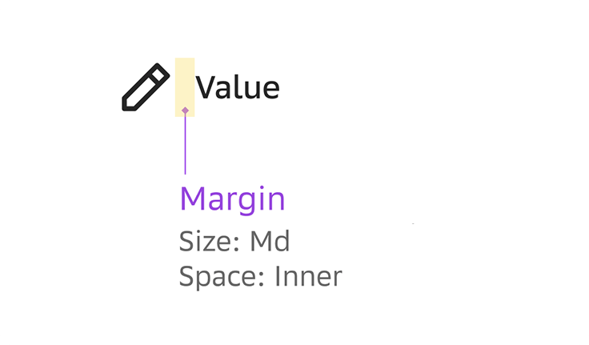
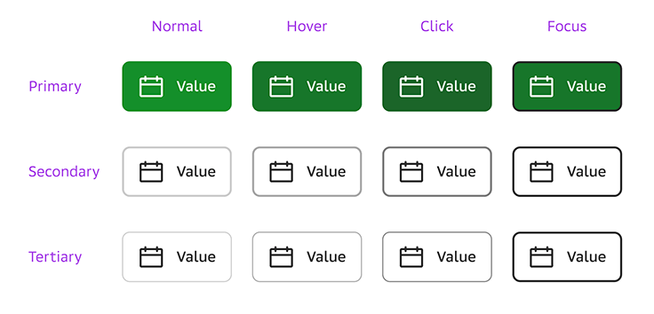

# 7. Создание простого компонента

Рассмотрим процесс сборки простого компонента на примере кнопки. Она состоит из текстового блока, иконки и плашки под ними.

## Создаем маркап

На первом этапе мы построим скелет будущего компонента (markup).

### Шаг 1: Создаем ядро компонента

Size: Md

### Шаг 2: Добавляем спутник

В компоненте Button спутником будет иконка. Создаем с помощью IconViewBox и настраиваем размер:

* Size: Md (20px) – в соответствии с типом ядра.

### Шаг 3: Группируем ядро и спутник

С помощью Dynamic Indent добавляем отступ между ядром и спутником и группируем все.

Параметры Dynamic Indent:

* Indents: Margin (так как это внешний отступ спутника)
* Direction: Horizontal
* Size: Md (в соответствие с типом ядра)
* Space: Micro (в следующем шаге вы увидите, что внутренние отступы всего компонента будут иметь уровень Inner, поэтому внутри компонента необходимо задать более низкий уровень для сохранения иерархии)

### Шаг 4: Создаем внутреннюю оболочку

Сначала создаем внутренние горизонтальные отступы.
С помощью инструмента Dynamic Indent добавляем по одному отступу слева и справа, и настраиваем значения параметров:

* Indents: Paddings
* Direction: Horizontal
* Size: Md (в соответствие с размером ядра)
* Space: Inner (так как сейчас мы формируем внутренний отступ всего компонента, то есть это самый верхний уровень в иерархии)

Добавляем пару вертикальных паддингов и настраиваем параметр Space – Micro. В данном случае мы уменьшаем размер паддингов чтобы компенсировать разницу между высотой иконки и текстового блока. Это соответствует правилам группировки и свойствам обёртки Padding Wrapper.

Горизонтальные отступы можно задать вместе с вертикальными с помощью обертки Padding Wrapper.

### Шаг 5: Задаем цвет

Цвет объектов задается с помощью токенов.

### Шаг 6: Задаем форму

Задаем радиус скругления.

### Шаг 8: Создаем поле компонента

К созданному компоненту добавляем вертикальные внешние отступы сверху и снизу того же типа, что и ядро. Уровень внешних отступов (Space) – такой же, как у внутренних.

## Создаем дочерние копии

С помощью инстансов можно создать разные типы (primery/secondary/tertary) и состояния компонента (normal/hover/click). С помощью инстансов нельзя создать разные размеры компонента (desktop / tablet / mobile) и сочетания элементов (text+icon / text only и т.п.) То есть для каждого размера кнопки необходимо будет создать отдельный маркап.

### Шаг 1: Создаем разные типы кнопки

Создадим первый тип кнопки – Primary с зеленым фоном и белым цветом иконки и текста. Для этого набросим на каждый элемент свой токен:

* для фона – стиль Button [Light]/Solid-Body-Normal
* для иконки – стиль Button [Light]/Solid-Text
* для текста – стиль Button [Light]/Solid-Text

Чтобы создать второй тип кнопки (Secondary) – создаем новую копию и набрасываем соответствующие токены:

* для фона – Button [Light]/Stroke-Body
* для обводки – Button [Light]/Stroke-Border-Normal
* для иконки – Button [Light]/Stroke-Text
* для текста – Button [Light]/Stroke-Text

### Шаг 2: Создаем разные состояния кнопки

Кнопки одного типа в разных состояниях отличаются друг о друга только цветом фона или обводки, поэтому процесс создания аналогичен тому, что описан выше. То есть меняем токен для фона и в одном состоянии добавляем обводку, токены для остальных элементов не изменяются.

Например, для типа Primary:

* состояния Hover: для фона – Button [Light]/Solid-Body-Hover
* Click: для фона – Button [Light]/Solid-Body-Click
* Focus: для фона – Button [Light]/Solid-Body-Focus +       добавляем обводку в 2px c токеном Palette [Light]/Focus

