# 8. Как собрать сложный компонент

Рассмотрим процесс сборки калькулятора из простых компонентов.

> **Показана концепция и порядок сборки. Для примера используются компоненты и инструменты из дизайн системы сбера NOV. Они не находятся в библиотеке компонентов**

## Шаг 1: Определяем состав

Набрасываем необходимые компоненты из библиотеки:

* Core – для заголовка и числового значения результата расчета
* Sputnik – для небольших описаний
* Text Field (Base + Dropdown) – текстовое поле с выпадающим списком для введения суммы
* Text Field (Base + Transparent Button) – текстовое поле с кнопкой-иконкой для выбора периода
* Slider – текстовое поле с ползунком для выбора периода
* Switch – переключатель для дополнительных опций
* Divider – разделитель
* Button (Text Only - Vertical Fixed) – кнопка с фиксированным размером по горизонтали + рекомендуем сразу добавлять в рабочую область
* Dynamic Indent – вспомогательный пробельный элемент для группировки объектов.

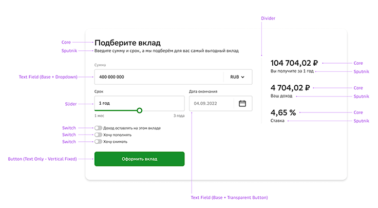

## Шаг 2: Продумываем струтуру

Главной функцией калькулятора является расчет по параметрам, значит ядром этого компонента будет группа полей и контролов для введения и настройки этих параметров.

Эта группа будет состоять из трех частей:

* Text Field (Base + Dropdown)
* Группа Slider + Text Field (Base + Transparent Button) – объединим эти компоненты, так как это взаимозаменяемые способы настройки одного параметра
* Группа из трех компонентов Switch

Спутниками в компоненте будут:

* группа текстовых пар для отображения результата расчета кнопка с целевым действием.

Так как калькулятор – это большой самостоятельный блок на странице, объединим ядро и все спутники в единую секцию с заголовком и описанием.

## Шаг 3: Создаем секцию

Создать блок Section:

Заголовок Core (size: Headline 2)

Описание Sputnik (size: Md / Zero Space)

Добавляем два динамических отступа сверху и снизу c помощью инструмента Dynamic Indent, настраиваем их параметры:

* Direction: Vertical
* Size: Headline 2
* Space: Inner Space
* Indents: Paddings

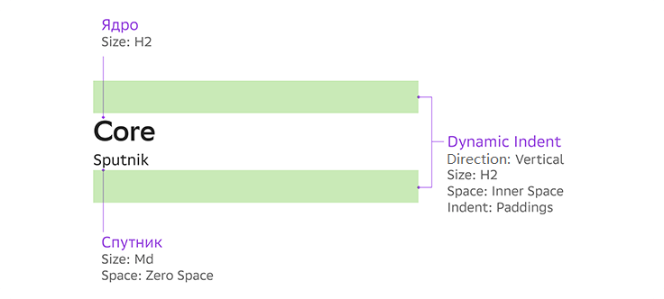

Добавляем два Dynamic Indent справа и слева группы, настраиваем параметры так же, как на предыдущем этапе (изменяется только параметр Direction на Vertical).

## Шаг 4: Формируем ядро

Сначала объединим компоненты Slider и Text Field (Base + Transparent Button), так как это взаимозаменяемые способы настройки одного параметра.

Добавляем между двумя полями Dynamic Indents и настраиваем параметры:

* Direction: Horizontal
* Size: Md (так как размер текстового ядра у компонентов Text Field и Slider – Md)
* Space: Inner (так как компоненты достаточно большие и самостоятельные)
* Indents: Margins

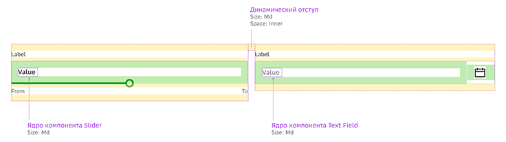

Объединяем всё в горизонтальную группу Wrapper1.

Выстраиваем блоки ядра друг под другом: Text Field (Base + Dropdown), группа Wrapper1. Меняем шаблонный текст и размер группы Wrapper1 – под дефолтный размер Text Field. Корректируем размеры полей под контент: ширину поля Slider немного увеличиваем, а поля Text Field (Base + Transparent Button) – уменьшаем.

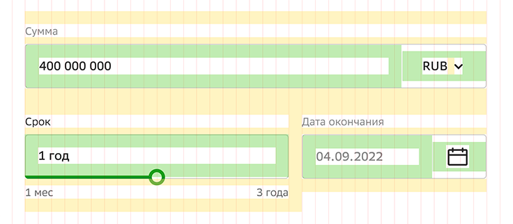

Объединяем группу Wrapper1 и Text Field (Base + Dropdown) в блок с помощью и называем Container-Md.
По правилам группировки компонентов:

* при столкновении двух Margin – меньший скрываем,
* в контейнере скрываем верхний отступ у самого верхнего компонента и нижний – у самого нижнего.

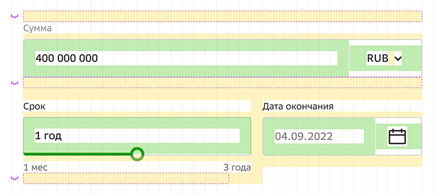

Добавляем контейнеру внутренние отступы сверху и снизу (размер Md – в соответствии со стилем текстового ядра, Space – Inner).

## Шаг 5: Создаем первый спутник

Объединяем три компонента Switch. Так как у компонента уже есть свои внешние отступы, Dynamic Indent для группировки нам не понадобится.

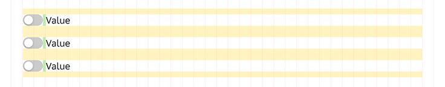

Как на предыдущем шаге, меняем шаблонный текст, скрываем «столкнувшиеся» маржины. Чтобы изолировать группу спутника от ядра, добавляем ей внутренние отступы сверху и снизу (Size: Sm, Space: Inner – так как это внутренняя оболочка всей группы). Если нам кажется, что расстояние сверху и снизу слишком большое, мы можем назвать группу Container-Sm и скрыть крайние отступы у верхнего и нижнего компонента.

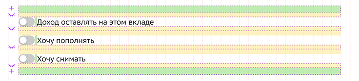

## Шаг 6: Создаем второй спутник

С помощью инструментов Core и Sputnik cоздадим три текстовые пары, вставим между ними Dynamic Indent и объединим все в группу. Сразу изменим шаблонный текст, чтобы правильно настроить расстояние между объектами.

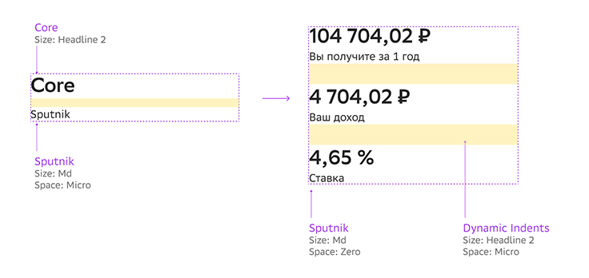

> Изменим у спутника дефолтное значение параметра Space: c Micro на Zero (то есть скрываем внешний отступ), так как здесь объем текста у спутника минимальный и, по нашему мнению, есть необходимость в более компактной группировке. У Dynamic Indent размер выставляется в соответствии с размером текстового ядра, а параметр Space уменьшим до Micro – так как он отделяет однотипные объекты внутри одной группы.

У этой группы будет собственный спутник в виде вертикального разделителя. Для начала объединим компонент Divider с двумя Dynamic Indent (размер отступов возьмем от ядра группы).

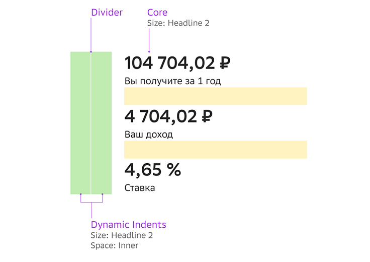

Объедим Divider и группу текстовых пар.

## Шаг 7: Объединяем все части

Сначала группируем все горизонтальные части: ядро, первый спутник и кнопку. Размер кнопки подстроится под ширину группы, но мы его можем изменить, например, сделать равным текстовому полю Slider.

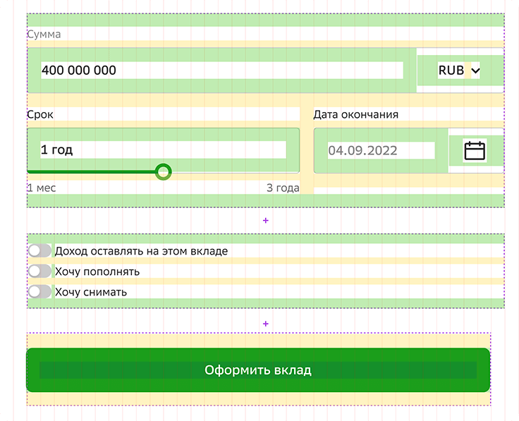

Объединим эту группу со вторым спутником.

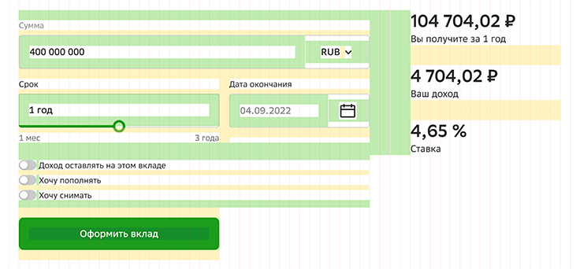

Вставим эту группу внутрь секции, которую мы создали на 3 шаге.

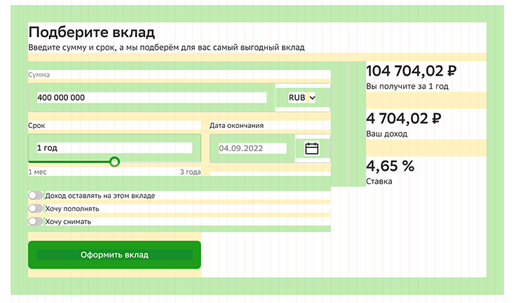

## Шаг 8: Задаем форму и цвет

Чтобы задать цвет и форму компоненту – на правой панели управления:

* выберем стиль токена для всего объекта
* набросим эффект Shadow
* зададим радиус скругления

Теперь можно задать внешние отступы для всего компонента или настроить их при общей сборке страницы.
