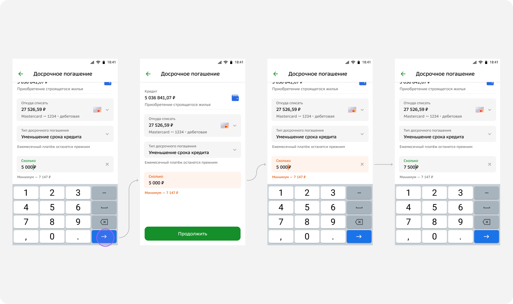

# 9. Правила валидации

Формы должны быть удобными для пользователя и эффективными для бизнеса. Мы собрали общие правила валидации, которые рекомендуем применять в любой форме СберБанк Онлайн.

## Кнопка всегда активна

Кнопка всегда активна (состояние Accept). Состояние Disabled не применяем для форм. Исключение для состояние Disabled: в форме всего одно очевидное и простое действие, например выбор из списка или взаимодействие с Draggable–компонентом.

## Скролл к первому полю с ошибкой

Если в форме есть ошибки, то после нажатия на кнопку форма скроллится к первому полю с ошибкой.

## Снек, если не заполнена вся форма

Если ни одно поле не заполнено, даже если пользователь заполнял и стёр данные, после попытки отправки формы не показываем ошибки в полях, а отображаем снекбар с общей ошибкой и скроллим форму в начало. Правило применимо для форм с 2мя и более обязательными полями. Если обязательное поле одно — стандартное отображение ошибки.

## Без автофокуса при ошибках

На мобильных устройствах после валидации по кнопке (или другому триггеру) не нужно ставить фокус в поле с ошибкой и поднимать клавиатуру.

## В каждом случае свой триггер валидации

### Проверка обязательности заполнения

Первый раз по кнопке (даже если ввёл и удалил), далее по вводу. Если на экране одно поле и количество символов предзадано, то валидация по вводу последнего символа

### Проверка регулярным выражением и по другим условиям

Первый раз по анфокусу, далее по вводу

### Проверка на минимум

Первый раз по анфокусу, далее по вводу

### Проверка на максимум

По вводу

## Запросы на бэк без отправки формы

Отправлять запрос на сервер и показывать ошибку на клиенте нужно по анфокусу. Исключение — формы требующие согласия пользователя на обработку данных.

## Ошибка не исчезает до следующей валидации

При фокусе на поле с ошибкой текст ошибки и выделение не пропадает до прохождения следующей валидации.

## Несколько текстов под разные ошибки в одном поле

Если для одного поля предусмотрено несколько проверок, то последовательно отображаются тексты всех ошибок, которые допустил пользователь. Форма подскролливается при увеличении количества (длины) ошибок валидации, чтобы клавиатура не перекрывала текст ошибки. Каждый текст ошибки с новой строки.

## Подсказка vs Ошибка

В незаполненном дефолтном состоянии отображается текст подсказки, если это нужно. При ошибке текст подсказки заменяется на текст ошибки. После исправления, снова отображается текст подсказки. По анфокусу, текст подсказки скрывается.

## Только доступные значения в списках для выбора

Если можно провести предвалидацию перед выводом списка для выбора, необходимо это сделать:

1. Отфильтровывать доступные значения, если отображение всех некритично.

    

2. Обозначить недоступные значения, если отображение всех критично.

    
